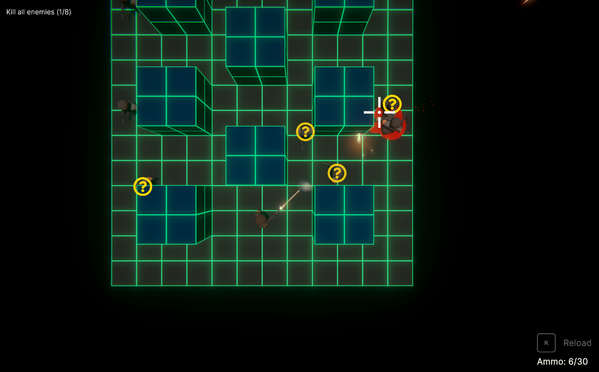

# Top-down Stealth Action Shooter - Stripped down Unity project
Disclaimer: This Github repo is a stripped down version of a bigger personal game project. For portfolio demonstration purposes, I made this repo as a clone of my real project and removed all third party assets to avoid licensing/legal issues. This means that this project won't compile and has many missing assets, so it's only for inspection purposes.

During a two-month development of this top-down stealth action shooter game, my aim was creating a vertical slice that both draws inspiration from and expands upon the gameplay of Metal Gear Solid: VR Missions (1999). All code in the Assets/Scripts folder of this repo has been written by me. 

You can read more about the project or grab a build to try out on my website: https://alexanderlarsen.com 

# License

This project is open-sourced under the MIT License - see the [LICENSE.md](https://github.com/alexanderlarsen/StealthActionTopdown-Stripped/blob/main/LICENSE) file for details.

# Contact

Get in touch at https://alexanderlarsen.com/contact
